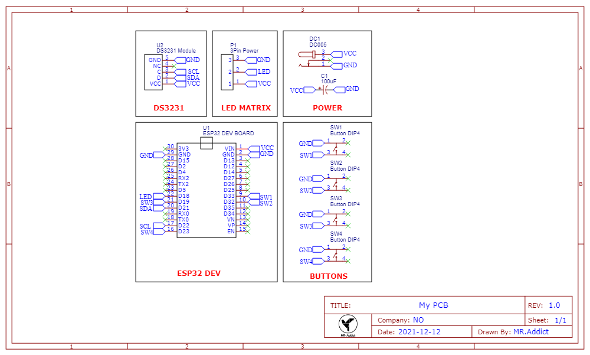

# WS2812LED Smart LED Matrix

## 1. Description

In this projects , I use a 16X16 LED matrix to find more possibilities on WS2812 LED.

## 2. Preparations

### 2.1 Libraries:

You must install FastLED and three more libraries that I write in my github pages.

About how to use my custom libraries , you can also go to  my github pages.

- [FastLED](https://github.com/FastLED/FastLED.git)
- [LEDMatrix](https://github.com/MR-Addict/WS2812LED-Matrix-Library.git)
- [LEDText](https://github.com/MR-Addict/WS2812LED-Matrix-Library.git)
- [LEDSprtie](https://github.com/MR-Addict/WS2812LED-Matrix-Library.git)

### 2.2 Components:

- **16X16 WS2812LED Matrix or Other size**
- **5V3A Power Adapter**
- **ESP32 DEV Board**
- **DS3231 module**
- **4 Buttons**

## 3. Set Up

### 3.1 Wiring your compoments:

You can solder you compoments like below schematic , or you can manufacture a custom PCB board using my Gerber files in *PCB* folder.

### 3.2 Upload Code:

Use arduino IDE and select ESP32 board to upload *SmartLED* to your board in *Arduino* Folder.

## 4. Control Your Matrix

### 4.1 Modes Built In:

There are 7 modes built in , including a welcome message when bootingup.
- **Bootingup Welcome Message**
- **Display Time**
- **Bouncing Ball**
- **Halo1**
- **Halo2**
- **Sprite Which are Mario and Minecraft Items**
- **Snake Game**
- **Draw Mode**

### 4.2 Control With Buttons:
You can use four buttons to control your LED matrix , buttons' functons are below:
|Button|Function|
|:---:|:---:|
|Button1|Turn ON/OFF LED Matrix|
|Button2|Auto Display ON/OFF|
|Button3|Previous Mode|
|Button4|Next Mode|

### 4.3 Control With UI:
In order to more easily control LED Matrix and use *WIFI* , I designed a UI to control Matrix written in porceesing language which in *Processing* folder.

Using this Panel We can also activate *Snake Game* and *Draw Mode* that buttons are not easily do.

Before you run processing code , you should make sure that you connect ESP32 Network which is *LED Matrix* and tht password is *123456789* by default.

## 5. Videos
